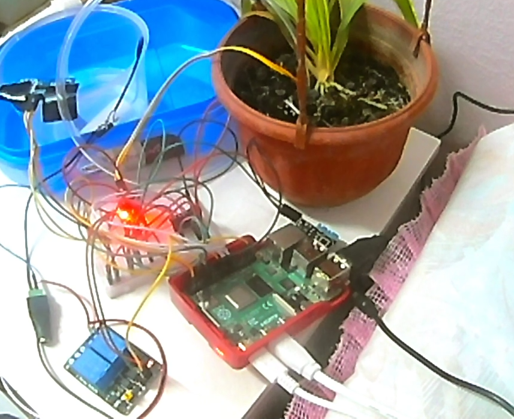

# Smart-Irrigation-System-Using-Raspberry-PI
Smart Irrigation System Using Raspberry Pi With Implementation of Logistic Regression

Hardware Used
- Raspberry PI
- Moisture Sensor
- DHT11 Sensor
- Ultrasonic Sensor
- Relay
- Water Pump

1. Import this code to your Android Studio
2. Machine Learning Implementation is using Python Language, hence it doesn't need to be 
inside the Android Studio. The file is named as Algorithm.py
3. Some credentials need to be change such as Firebase Credentials to your own Firebase link.

Format: 
